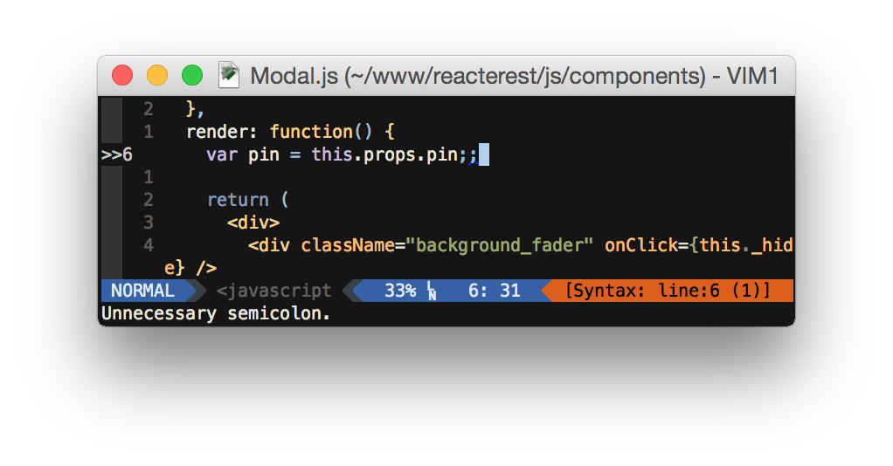
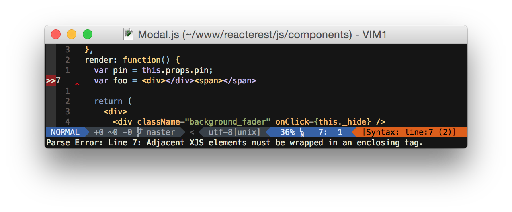

# Syntastic Checker for React JSX files

This is a simple wrapper that:
* Tries to compile as JSX
* Checks if the JSX compiler throws errors, and sends them to Syntastic if so
* Otherwise, passes JS to JSHint and outputs any errors found there

This gives you the power of syntax checking in Vim, without the annoyance of "unexpected regular expression". Awesome.





# Usage

```
npm install -g syntastic-react
```

If you don't have jshint or react-tools, install those too:

```
npm install -g jshint
npm install -g react-tools
```

Add these lines to your vimrc:

```
let g:syntastic_javascript_checkers = ['jsxhint']
let g:syntastic_javascript_jsxhint_exec = ['jsx-jshint-wrapper']
```

And, of course, install Syntastic.

# More info

This is a part of [a blog post on setting up Vim for React development](articles/setting-up-vim-for-react-js-jsx-02-03-2015).

## Why? What about JSXHint?

JSXHint is being sunsetted and [doesn't handle React errors correctly](https://github.com/STRML/JSXHint/issues/45). This code is a simple wrapper that brings the best of both worlds, though this one is designed specifically for use with syntastic, and thus will not run the same way as the previous JSXHint wrapper.

## About me

I'm Jonathan, I work on random Vim plugins, web development, Node.js, Android, and whatever else I feel like. [Follow me](https://github.com/jaxbot) if you're curious, or just want to make my day!
